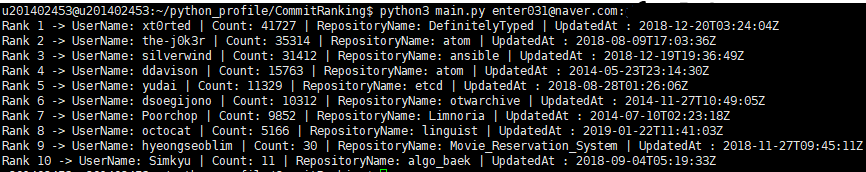
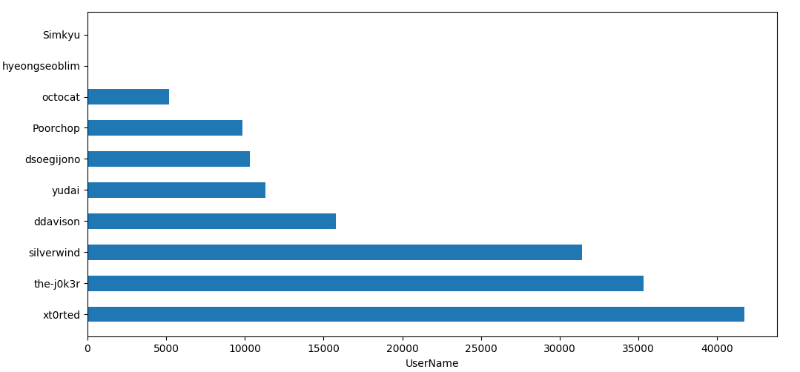
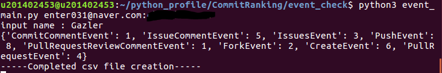
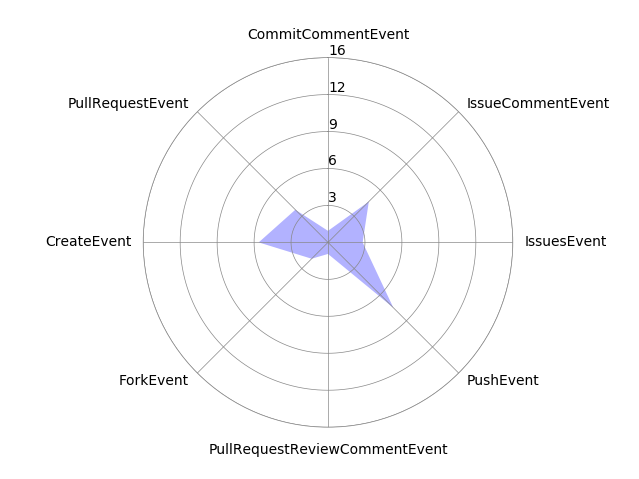

# CommitRanking

### It ranks the number of commit in the github repository of the designated personnel.

1. Using Interface
	- Rest API
	- GraphQL API

2. Using Language
	- Python 3.5.2

3. Reference site
	- https://developer.github.com/v3/     [Rest API]
	- https://developer.github.com/v4/     [GraphQL API]

4. How to use (commit_info_crawler)
	- Fill in the user_list/Uname_list file with the name of the person you want to search for, one per line.
	- python3 main.py userID:userPWD  <-- Run command

5. Output Type
	- Rank [count] -> UserName: [UserName] | Count: [CommitCount] | RepositoryName: [RepositoryName] | UpdatedAt: [LastUpdatedTime]

6. Result Data

7. Draw Bar Chart

---
## Github User EventData
#### It crawls the user's events independently of the RankingCommit.

1. How to use (event_check)
	- python3 event_main.py userID:userPWD <-- Run command
	- input name: [Here!] -> Enter the name of the user you want to crawl!!!

2. Result Data

3. Draw Radar Chart
	- The position of the value displayed in the radar chart is random

#### The data for output is a random user in Github.
